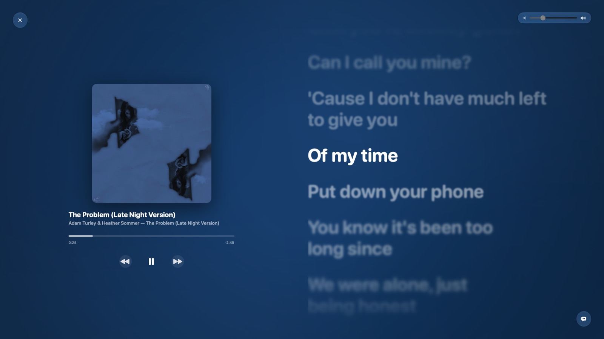
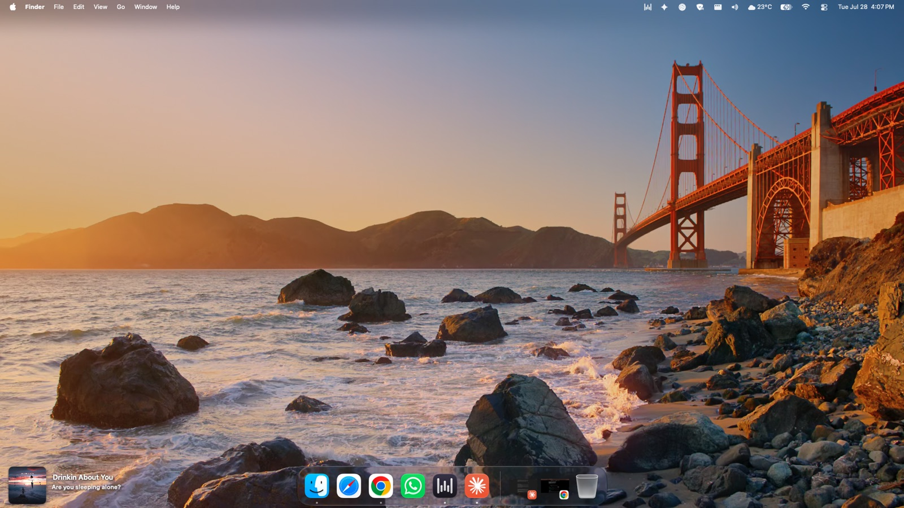
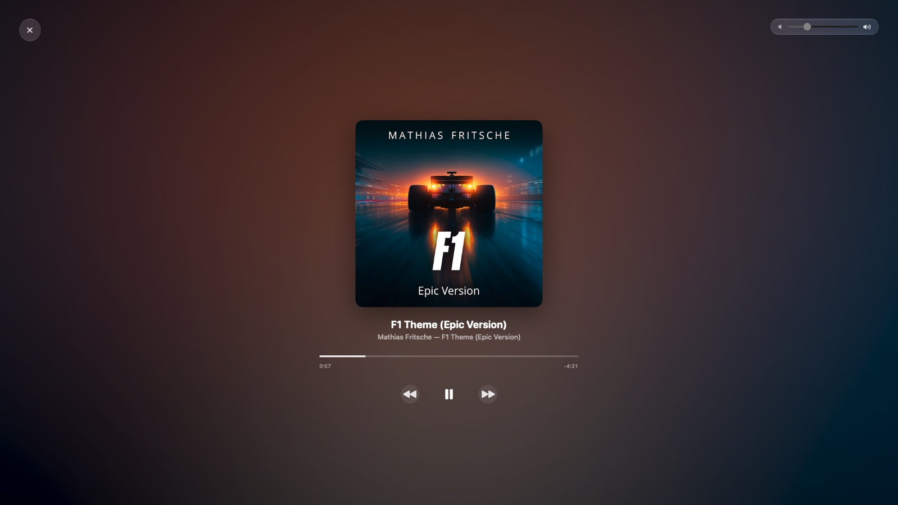
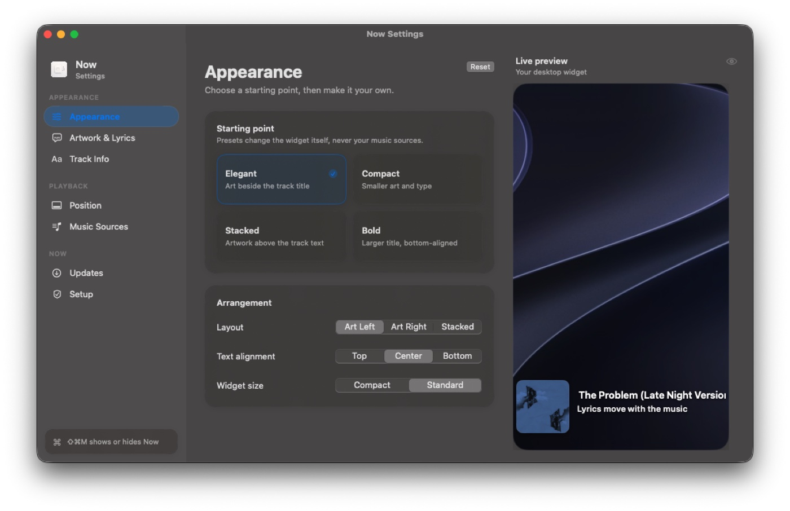

# Now

**A native macOS menu bar app that gives any music you play a proper Now Playing experience.**

A quiet overlay on your desktop while you work, and a full screen view with time synced, word by word lyrics when you want to sit with the music.

[**Download the latest release**](https://github.com/LakshyaSingh/now-updates/releases/latest) &nbsp;·&nbsp; macOS 14 or later &nbsp;·&nbsp; Updates itself

---

## Why it exists

Most people don't listen to music in a dedicated desktop app. They listen in a browser tab, usually YouTube Music. That means the artwork is a thumbnail, the controls are buried behind whatever window is in front, and lyrics either don't exist or have to be looked up by hand.

Now fixes that without asking you to change services. It reads whatever is already playing and presents it properly.

The genuinely hard part isn't showing a song title. It's that Chrome cannot reliably tell macOS *which* tab is playing music, so the system's own media keys will happily pause a video in a completely different tab. Now solves that with URL aware browser integration and an optional companion extension, so controls always target the real music tab.

---

## Screenshots

### Desktop overlay

Pinned to the corner of your desktop, above the wallpaper but below your windows, with the current lyric line moving in time with the song.

### Full screen, without lyrics

When a track has no synced lyrics, or you switch them off, the artwork and controls centre on their own.

### Settings

---

## Features

**Desktop overlay**
- Sits at a chosen edge of the desktop, never covering your work
- Album art, title, artist, and playback controls
- Live single line lyrics, synced to the track
- Two finger swipe on the artwork to change tracks, previewing the real next and previous covers as you swipe
- Show or hide instantly with `⇧⌘M`

**Full screen view**
- Blurred backdrop drawn from the artwork itself, so a dark cover gives a dark room and a bright one a bright room
- Large synced lyrics with the current line sharp and bright while the rest fall out of focus
- Word by word highlighting where the source provides word level timing
- Instrumental breaks appear as animated dots in their proper place in the timeline, so you can see a gap coming
- Click the progress bar to seek, space to play or pause, escape to exit
- Lives on its own Space, so a three finger swipe moves between it and your work

**Playback and sources**
- YouTube Music and Spotify in Safari or Chrome, plus the Spotify and Apple Music desktop apps
- Play, pause, next, previous, seek, and volume
- Pauses browser music while the microphone is in use, for dictation apps and calls, then resumes. Desktop players are left alone since they already handle this themselves
- Detects when the browser quits mid song and stops cleanly instead of showing a track that isn't playing

**Lyrics**
- Four sources are tried in turn, so obscure and non English tracks usually still resolve
- Results are cached, and a failing source is skipped for a while rather than slowing everything down
- Credit lines are stripped, and instrumental tracks are labelled instead of showing nothing

**Appearance**
- Layout, font sizes and weights, corner radius, and artwork size are adjustable, with presets to start from
- Choose which display it appears on, or have it follow the pointer
- Real Liquid Glass controls on macOS 26 and later, with a translucent fallback on earlier versions

---

## Install

1. Download the DMG from the [latest release](https://github.com/LakshyaSingh/now-updates/releases/latest).
2. Open it and drag **Now** into Applications.
3. Launch it from Applications. The build is ad hoc signed, so the first launch needs a right click on the app, then **Open**.

Now lives in the menu bar. There is no Dock icon and no main window.

### Permissions

A short setup assistant runs on first launch and asks for what it needs:

- **Automation**, so Now can read and control the music tab in your browser
- **Accessibility**, for the global `⇧⌘M` shortcut

If you use Safari, also enable **Develop → Allow JavaScript from Apple Events**. In Chrome the same setting lives under **View → Developer**.

Then open **Settings → Sources** and turn on the players you actually use. Everything else is ignored, which is what stops a random video tab from taking over the overlay.

---

## Optional Chrome extension

Only needed for artwork previews while swiping between tracks in YouTube Music. Everything else works without it.

1. Download `Now-Chrome-Extension-<version>.zip` from the [latest release](https://github.com/LakshyaSingh/now-updates/releases/latest) and unzip it.
2. Open `chrome://extensions` and turn on **Developer mode**.
3. Click **Load unpacked** and select the unzipped `ChromeExtension` folder.

The same folder also ships inside the app, reachable from the setup assistant's **Show Chrome Extension…** button.

---

## Updates

Now checks for updates on its own and installs them in the background. Every update is cryptographically signed and verified before it is applied.

## About this repository

This repository hosts the release downloads and the signed update feed. The application source is not published here.
